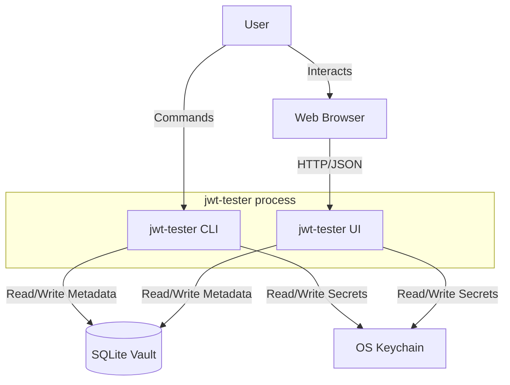
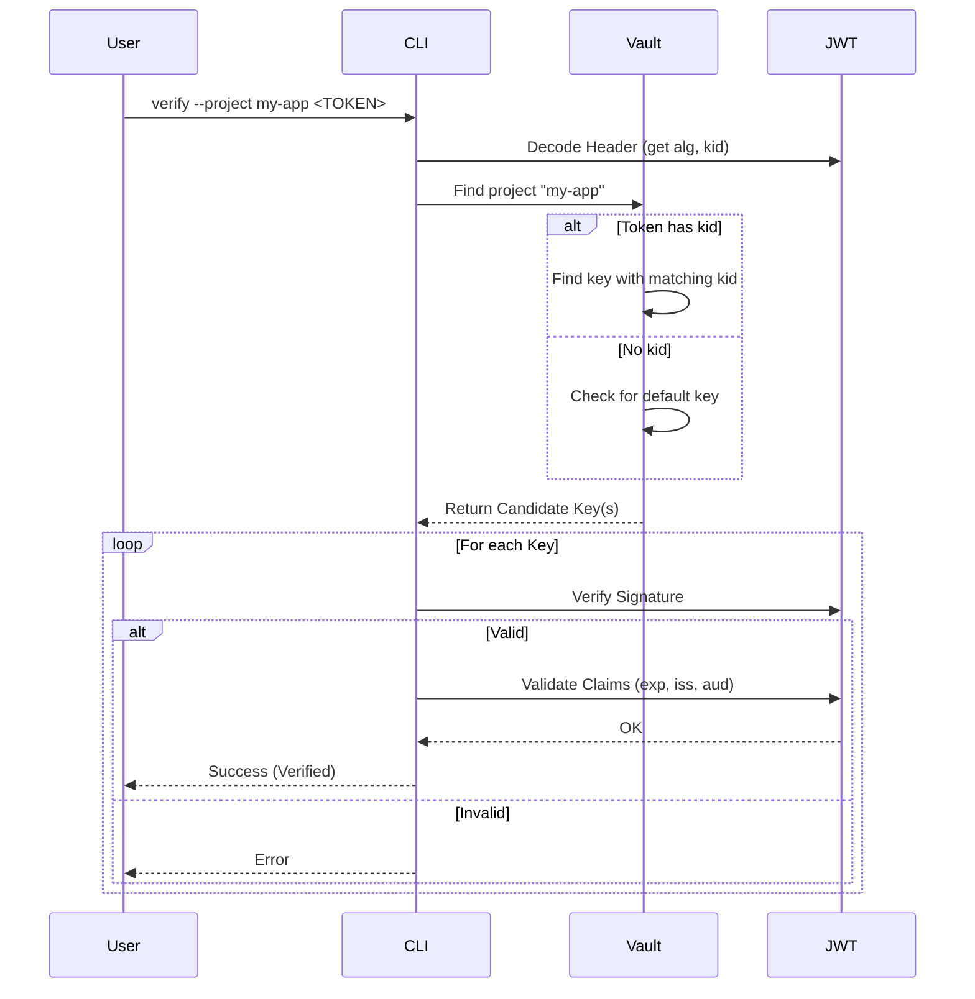
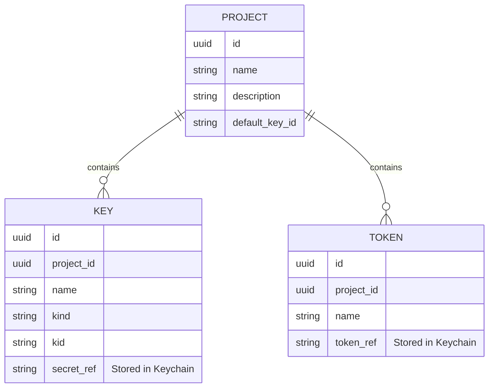

# Architectural Diagrams

## System Context

This diagram shows how `jwt-tester` fits into the user's environment.

## Verify Command Flow

How the tool resolves keys and verifies a token.

## Vault Data Model

Relationship between entities.

